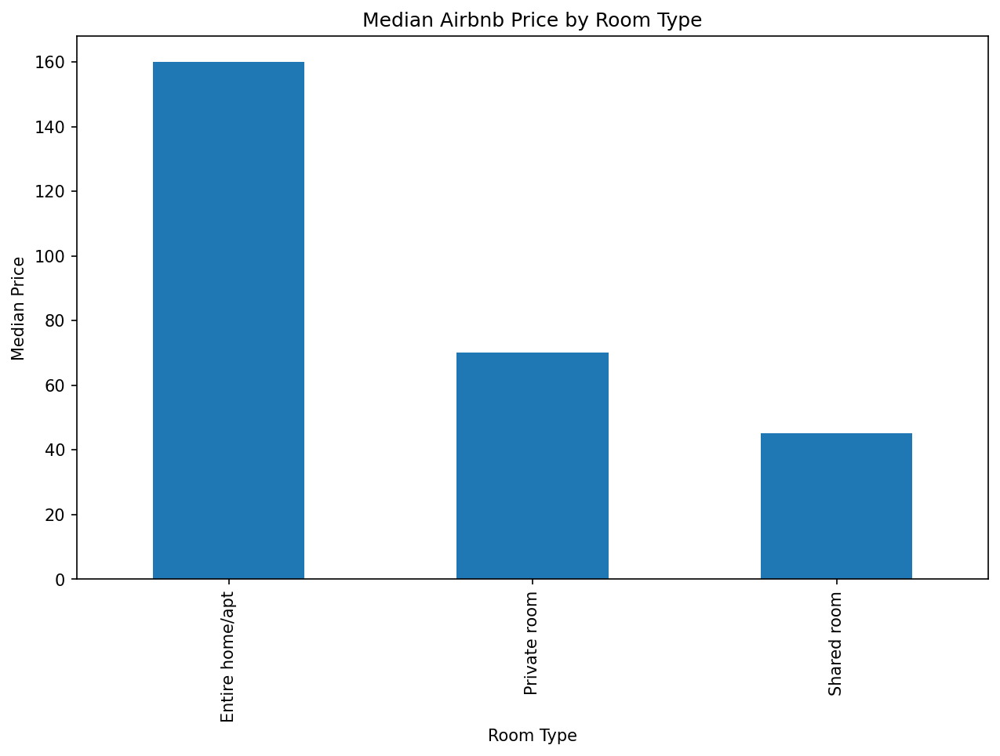
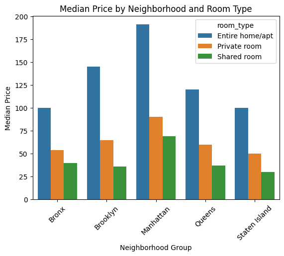
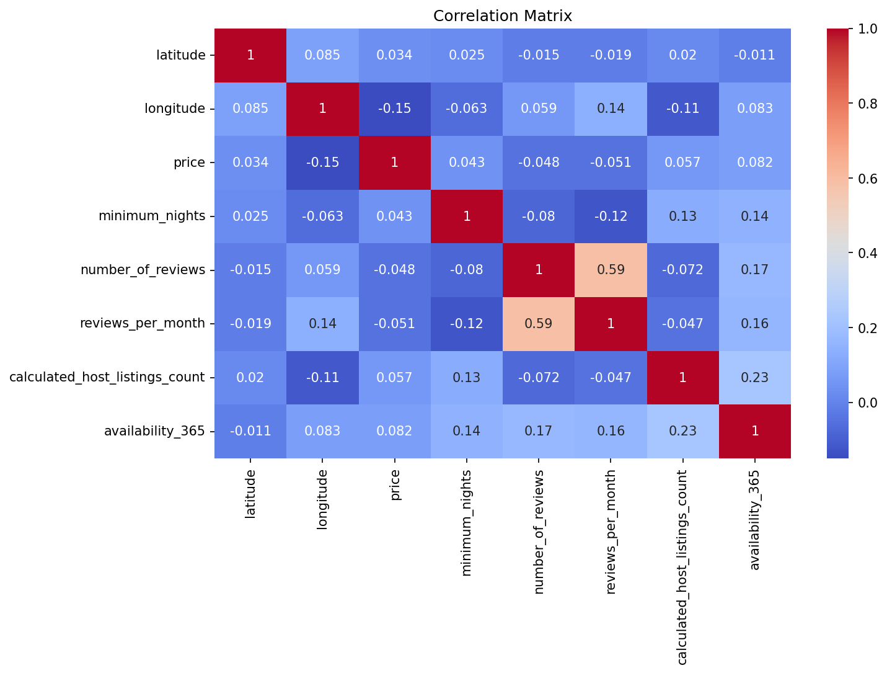

# Airbnb NYC — Exploratory Data Analysis

Exploratory Data Analysis of the **New York City Airbnb Open Data** dataset to understand pricing patterns, room types, neighbourhood groups, reviews, and availability.

## 📂 Dataset

**New York City Airbnb Open Data** — Kaggle

- **Rows:** 48,895
- **Columns:** 16
- **Source:** [Kaggle Dataset](https://www.kaggle.com/datasets/dgomonov/new-york-city-airbnb-open-data/data)

The dataset contains information about Airbnb listings in New York City, including prices, room types, neighbourhood groups, reviews, minimum nights, and availability.

## 🔍 Analysis

The analysis covers:

- Data understanding and cleaning
- Missing-value and duplicate analysis
- Price distribution and outlier analysis
- Minimum nights distribution
- Listings by neighbourhood group and room type
- Median price by room type
- Median price by neighbourhood group
- Median price by neighbourhood group and room type
- Reviews and price analysis
- Correlation analysis

## 💡 Key Findings

- **Manhattan and Brooklyn** have the most Airbnb listings.
- **Entire home/apt** has the highest median price among room types.
- **Manhattan** has the highest median listing price among neighbourhood groups.
- Price, minimum nights, and number of reviews are highly right-skewed.
- Room type and neighbourhood group show clear differences in median price.
- `number_of_reviews` and `reviews_per_month` show the strongest positive correlation in the dataset (**0.59**).
- The correlation between price and most numerical variables is relatively weak.

## 📊 Selected Visualizations

### Median Price by Room Type



### Median Price by Neighbourhood Group and Room Type



### Correlation Matrix



## 🛠️ Tools

- Python
- Pandas
- NumPy
- Matplotlib
- Seaborn
- Jupyter Notebook

## 📌 Methodology

The project followed an exploratory data analysis workflow:

1. Loaded and inspected the dataset.
2. Checked data types, missing values, and duplicates.
3. Analyzed distributions and identified potential outliers.
4. Examined listing patterns across room types and neighbourhood groups.
5. Compared median prices across different categories.
6. Analyzed the relationship between reviews and price.
7. Calculated correlations between numerical variables.
8. Visualized the main findings using Python.

## 💼 Analytical Value

This project demonstrates the ability to:

- Explore and understand a real-world dataset
- Clean and validate data
- Handle missing values appropriately
- Identify skewed distributions and outliers
- Perform group-based analysis using Pandas
- Analyze relationships between variables
- Calculate and interpret correlations
- Create clear data visualizations
- Communicate analytical findings effectively

## 📂 Project Structure

```text
Airbnb-NYC-EDA/
│
├── Airbnb_NYC_EDA.ipynb
├── README.md
├── AB_NYC_2019.csv
├── median_price_room_type.png
├── median_price_neighborhood_room_type.png
└── correlation_matrix.png
```
## 📌 Conclusion

The analysis reveals clear pricing differences across room types and neighbourhood groups in New York City. **Entire home/apt** listings have the highest median prices, while **Manhattan** has the highest median listing price among neighbourhood groups.

The analysis also shows that several numerical variables have highly skewed distributions, while most numerical relationships are relatively weak. The strongest positive correlation is between `number_of_reviews` and `reviews_per_month`, with a correlation coefficient of **0.59**.

These findings provide a useful foundation for further analysis and potential **price-prediction modeling**.
